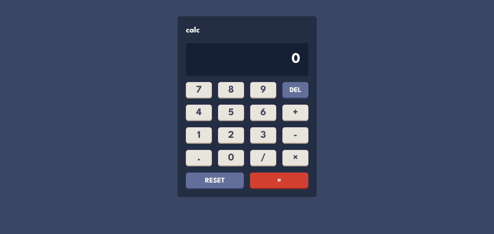

# Calculator app solution

This is a solution to the [Calculator app challenge on Frontend Mentor](https://www.frontendmentor.io/challenges/calculator-app-9lteq5N29). Because every developer must create the calculator

## Table of contents

- [Overview](#overview)
  - [The challenge](#the-challenge)
  - [Screenshot](#screenshot)
  - [Links](#links)
- [My process](#my-process)
  - [Built with](#built-with)
  - [Useful resources](#useful-resources)
- [Author](#author)

## Overview

### The challenge

Users should be able to:

- See the size of the elements adjust based on their device's screen size
- Perform mathmatical operations like addition, subtraction, multiplication, and division

### Screenshot

### Links

- Solution URL: [Code](https://github.com/darynadudar/calculator)
- Live Site URL: [Preview](https://darynadudar.github.io/calculator)

## My process

### Built with

- [Vue](https://vuejs.org/) - JS library
- Vite
- SCSS - For styles
- Semantic HTML5 markup
- Flexbox
- Mobile-first workflow

### Useful resources

- [Clean Vue 3 Code with Global SCSS Variables in Vite](https://mark-amoah.medium.com/clean-vue-3-code-with-global-scss-variables-in-vite-a-step-by-step-guide-to-organizing-your-713e7b42ba82) - This helped me to connect SCSS variables to the project. I will use it going forward.

## Author

- Linkedin - [Daryna Dudar](https://www.linkedin.com/in/daryna-dudar-4aba70227/)
- Dou - [Daryna Dudar](https://dou.ua/users/daryna-dudar/)
- Frontend Mentor - [@darynadudar](https://www.frontendmentor.io/profile/darynadudar)